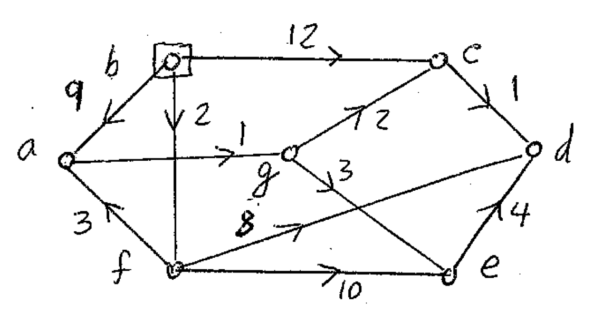

	
# Assignment 5

In the assignment, you will develop a graph implementation and then use it to implement at least one graph algorithm. In particular, you will implement (at least) Dijkstra's algorithm for finding the shortest path.


This image is the example used for the test cases.

## Part I. Graph Representations

In this part of the assignment, you will implement a graph representation to be used later in Part II.

The assignment has several files provided:

Graph.java - Graph interface.

AbstractGraph.java - Abstract (incomplete) implementation of the Graph interface.

AdjListGraph.java - Graph implementation using an adjacency list. Fill in the remaining code.

Edge.java - Edge class. Fill in the opposite method.

Vertex.java - Vertex class.

## Objectives

TODO #1: Implement the incidentEdges function in ExtendedGraph.java

TODO #2: Implement the initializeSingleSource function in Path.java

TODO #3: Implement the dijkstra function in Path.java

This assignment will test your grasp of Dijkstra's algorithm.  
The steps are found within each function and it is your job to code it out.  

# Hints  

Below you will find the pseudo-code.
```
Initialize-single-source(G, s):  
  for each vertex of all vertices in G:
    v.d = infinity
    v.pi = NIL
  s.d = 0
  
RELAX(u,v,w):
  if u.d+w(u,v) < v.d:
    v.d = u.d + w(u,v)
    v.pi = u

Dijkstra(G,w,s):
  Initialize-single-source(G, s)
  Q = null set(O/) (priority queue)
  for each vertex U in G:		
    Enqueue(Q, U)
  while Q is not empty:		
    u = extract minimum(Q)	
    for each vertex v adjacent to u:	
      RELAX(u,v,w)
    update values of each vertex in the priority queue
```

## What to Do 

Fill in the remaining code for ExtendedGraph.java, and Path.java. Your code should be efficient and must have the minimal big-Oh possible for the given implementation.

public List<Edge> incidentEdges(Vertex v): returns the list of edges originating at v.

public static List<PathVertex> dijkstra(ExtendedGraph g, Vertex v): The implementation of the main algorithm. Extra credit, use a priority data structure to improve performance.

public static List<PathVertex> initializeSingleSource(ExtendedGraph g, Vertex s): The starting step for Dijkstra Algorithm.
* This sets every PathVertex's parent to null and its distance to the source infinity except for the source (s) where its distance is 0 and gets the vertices (which is of type Vertex) from g and creates a List of type PathVertex.

## Part II. Graph Algorithms

In this part of the assignment, you will use the graph representation you created in Part I to read a description of a graph and answer questions about it. In particular, you should use Dijkstra's algorithm to find the shortest paths in the graph.

## What to Do
Write a program that reads a description of an undirected graph with weighted edges, then answers questions about paths in that graph. More specifically, the program should operate as follows:

The program should begin execution in a main method in a class named Paths. This program should accept two command line arguments: the name of a text file containing a list of vertices, and the name of a second text file giving the edges between these nodes. 

The files are specified as follows:
* Nodes: This file has one line per vertex and each line contains a text string with the vertex name.
* Edges: This file has three lines per edge. The first two lines give the node names at either end of the edge. The third line is a string of digits that give the distance (or weight) on that edge (this line should be converted to a number to be stored in the graph).

## Additional Files and Information
Two sample data files are available representing information about airports and the distances between them. 
* File vertex.txt contains a list of 3-letter airport codes, each of which represents a vertex in the graph. 
* File edge.txt contains information about edges in the graph. Each edge is described by two lines that each contain an airport code, and a third line gives the distance between them. 

You may assume that every node name that appears in a path (edge) also appears in the vertex list.

When the program begins execution, it should read the two data files and build an adjacency list representation of the graph that they represent. The data describes an undirected graph; in the adjacency list representation you should represent each undirected edge as a pair of directed edges, one in each direction between the two vertices.
Although not required, you may find it useful to provide some way to print or display the graph at this point to ensure that it has been read and stored properly.

Once the graph has been built, the program should loop repeatedly and allow the user to ask for information about paths in the graph. The user should enter two vertex names. If there is a path from the first to the second vertex, the program should describe the shortest such path, including the vertex names on the path and the total length. If there is no path, a descriptive message should be printed (i.e., if either name is not a vertex in the graph or if there is no path between the given vertices).

Your program must use Dijkstra's algorithm to compute the shortest paths in the graph.

You need to decide how the end of input is indicated and have the program quit gracefully when the end of input is reached.

Examples: If the user enters SEA DEF, then the output might look like SEA ABC DEF 1234 if the shortest path from SEA to DEF runs through node ABC and has a total length of 1234.
You should use the graph implementation from Part I as a starting point.

## Extra Credit

Improve your implementation of Dijkstra's by using a priority queue. For this, you could modify your code from previous homework or start from scratch. One modification you will need to make to your priority queue code from the previous homework is for Dijkstra's algorithm, we need to be able to find items in the priority queue and update their priorities. 

The simplest implementation of this can just do a sequential scan to locate an item, then adjust the priority, and move the item to its proper place in the heap. A more complex implementation would allow items in the priority queue to be accessed in constant time. 

A simple sequential search of the queue is fine for small graphs, but for large graphs, we would like to be able to find items in constant time so the total time needed to update a priority is a constant plus the log n time needed to reestablish the heap property in the queue. 

There are various ways to do this, including keeping a back-pointer from each vertex to its entry in the queue.


## Testing

* Testing can be done through Maven with the command, <br>
  `mvn test` <br>
* To run more specific tests, run the command <br>
  `mvn -Dtest=AssignmentTest#TESTCASEHERE test` <br>
  where `TESTCASEHERE` is the test case you want to run. These test cases can be found in **src/test/java/AssignmentTest** <br>
    * Ex:  `mvn -Dtest=AssignmentTest#testIncidentEdges test`

The results can be found in the command line or in **target/surefire-reports/AssignmentTest.txt** after execution.

**Part of grading will be these test cases.**

Alternatively,

You can use the main method found in Path.java. The test cases are derived from that main method.

